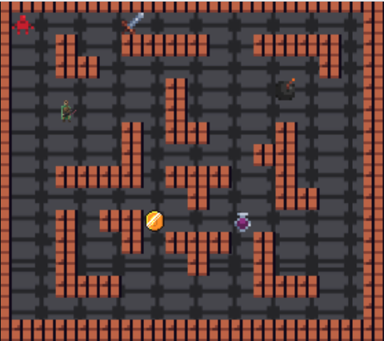

Group Project for COMP2511 

## 1. Aims

* Apply OOP software design principles and patterns to create well-maintained software solutions
* Synthesise and adapt to changes in requirements
* Practice software design and development in a dynamic team environment using Agile principles
* Work with the Java Programming Language and Java Class Libraries
* Build medium-scale persistent web applications from scratch
* Appreciate issues in the design and development of software

## 2. Overview

For many years, Penguin Pty Ltd (a small software business run by Atilla Brungs) has dominated the native application gaming market with hit games. However in recent years, advancements in web technologies mean that the new generation of consumers don't want to download and run a native application, but instead want to play games online. To adapt to the ever-changing market, Penguin Pty Ltd has decided to take users back to the 1980s and develop a new game called *Dungeon Mania*, but with a modern twist - designed as a web application.

Penguin Pty Ltd has sub-contracted two software firms:

* BlueBottle Pty Ltd to develop a web-based frontend to the game
* YourTeam Pty Ltd (a team of talented misfits completing COMP2511 in 22T2), who will build the backend Java application.

Furthermore, there is a rival company called Spheniscidae Pty Ltd which has already produced a solution which you can refer to as a possible sample solution. 

# Part II) Product Specification

## 3. Rules of the Game

In Dungeon Mania you control a Player and have to complete various goals within a series of dungeons to complete the game!

The simplest form of such a puzzle is a maze, where the Player must find their way from the starting point to the exit.

More advanced puzzles may contain things like boulders that need to be pushed onto floor switches,

enemies that need to be fought with weapons, or collectables like potions and treasure.

